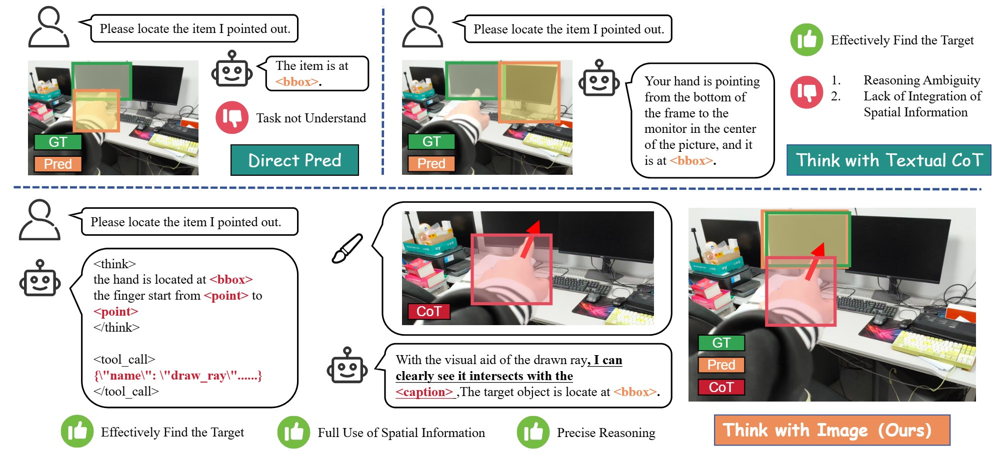
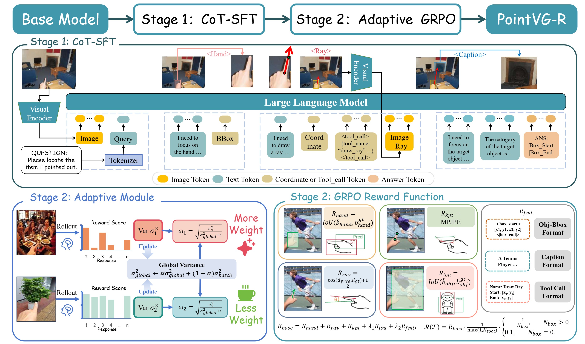

# PointVG-R

<p align="center">
  
</p>

<p align="center">
  Reinforcement learning for visual pointing understanding, built on top of <code>veRL</code>.
</p>

<p align="center">
  <a href="#highlights">Highlights</a> ·
  <a href="#pipeline">Pipeline</a> ·
  <a href="#quick-start">Quick Start</a> ·
  <a href="#data-format">Data Format</a> ·
  <a href="#reward-design">Reward Design</a>
</p>

## Overview

`PointVG-R` is an RL training project for visual pointing understanding. It extends the in-repo `verl` framework and focuses on multi-modal, multi-turn training with a custom reward tailored to pointing behavior.

The current codebase is centered around:

- Multi-GPU PPO/GRPO training with `Ray + veRL/FSDP + vLLM`
- Multi-modal text-image-video inputs
- Multi-turn rollout with tool-style interaction
- A custom reward that jointly scores hand boxes, pointing rays, keypoints, and target object boxes

## Highlights

- End-to-end RL training pipeline for pointing-grounding style tasks
- Open-source training entry script in [`PointVG-R/train.sh`](PointVG-R/train.sh)
- Config-driven setup through [`PointVG-R/config.yaml`](PointVG-R/config.yaml)
- Custom reward function entrypoint in [`PointVG-R/reward_function/reward_func.py`](PointVG-R/reward_function/reward_func.py)
- Compatible with large-scale distributed training in the bundled `verl` framework

## Pipeline

<p align="center">
  
</p>

The training loop combines:

1. Multi-modal instruction input
2. Multi-turn rollout generation with `vLLM`
3. Structured reward computation from pointing-related annotations
4. Policy optimization through GRPO/PPO-style updates

## Repository Structure

```text
PointVG-R/
├── PointVG-R/
│   ├── config.yaml
│   ├── train.sh
│   └── reward_function/
│       └── reward_func.py
├── dataset/
├── pictures/
├── scripts/
├── tests/
├── verl/
└── pyproject.toml
```

Key components:

- [`PointVG-R/train.sh`](PointVG-R/train.sh): training launcher with commonly used hyperparameters
- [`PointVG-R/config.yaml`](PointVG-R/config.yaml): default training configuration
- [`PointVG-R/reward_function/reward_func.py`](PointVG-R/reward_function/reward_func.py): custom reward entrypoint `compute_score`
- [`verl/`](verl): core training framework, including actor, rollout, reward, and trainer modules
- [`dataset/`](dataset): recommended location for training and validation data

## Quick Start

### 1. Prepare paths

Update the placeholders in [`PointVG-R/train.sh`](PointVG-R/train.sh):

- `MODEL_PATH`
- `TRAIN_FILES`
- `VAL_FILES`

### 2. Launch training

```bash
bash PointVG-R/train.sh
```

The script eventually runs:

```bash
VLLM_USE_V1=1 python3 -m verl.trainer.main ...
```

### 3. Main runtime knobs

Common settings exposed in the script include:

- learning rate, weight decay, scheduler, and warmup
- KL control parameters
- rollout temperature and `top_p`
- prompt / response / model length limits
- multi-turn rollout settings
- reward function path
- advantage importance weighting options

## Training Configuration

The default configuration lives in [`PointVG-R/config.yaml`](PointVG-R/config.yaml).

Important fields:

- Data:
  - `data.train_files`
  - `data.val_files`
  - `data.prompt_key`
  - `data.answer_key`
  - `data.image_key`
  - `data.video_key`
  - `data.max_prompt_length`
  - `data.max_response_length`
  - `data.max_pixels`
- Model:
  - `worker.actor.model.model_path`
  - `worker.actor.model.trust_remote_code`
  - `worker.actor.model.lora.rank`
- Rollout:
  - `worker.rollout.n`
  - `worker.rollout.temperature`
  - `worker.rollout.top_p`
  - `worker.rollout.limit_images`
- Trainer:
  - `trainer.total_epochs`
  - `trainer.n_gpus_per_node`
  - `trainer.save_freq`
  - `trainer.val_freq`

## Data Format

The dataset is loaded through [`verl/utils/dataset.py`](verl/utils/dataset.py). The default config uses:

- `prompt_key: prompt`
- `answer_key: ground_truth`
- `image_key: images`
- `video_key: videos`

Each sample should contain at least:

- `prompt`: text instruction for the model
- `ground_truth`: annotation payload consumed by the reward function
- `images` or `videos`: optional multi-modal inputs

Example `jsonl` sample:

```json
{"prompt":"Please identify the object being pointed at in the image.<image>","ground_truth":"{\"hand_bbox\":[10,20,100,120],\"pointing_ray\":{\"start\":[40,60],\"end\":[180,200]},\"pointing_keypoints\":[[40,60],[180,200]],\"obj_bbox\":[150,170,260,320]}","images":["example.jpg"]}
```

Notes:

- `ground_truth` can be a JSON string or a dictionary
- if `image_dir` is configured, relative image or video paths are joined with that directory
- prompts containing `<image>` or `<video>` are converted into multi-modal chat-template inputs
- the dataloader normalizes the answer field into the `ground_truth` field used during training

## Reward Design

The reward function is defined in [`PointVG-R/reward_function/reward_func.py`](PointVG-R/reward_function/reward_func.py):

```python
compute_score(reward_inputs: List[Dict[str, Any]], **kwargs) -> List[Dict[str, float]]
```

The current reward combines:

- `hand_iou`: IoU between predicted and ground-truth hand boxes
- `ray_cos`: directional consistency of the pointing ray
- `kpt_score`: normalized keypoint distance score
- `obj_iou`: IoU between predicted and ground-truth target object boxes
- `stage2_format`: whether the response satisfies the expected stage-2 format

Overall scoring is roughly:

```text
base = hand_iou + ray_cos + kpt_score + obj_iou * 5 + stage2_format * 2
reward = clamp(base * tool_penalty * bbox_penalty, 0, 10)
```

Additional behavior in the implementation:

- repeated `draw_ray` calls reduce reward through `tool_penalty`
- multiple object boxes after the last tool call reduce reward through `bbox_penalty`
- negative samples follow a separate scoring path

## Notes

- This repository is organized around the bundled `verl` training framework rather than as a standalone minimal script
- The default setup assumes a distributed multi-GPU environment
- You may want to adapt batch size, sequence length, and rollout settings to your hardware budget
